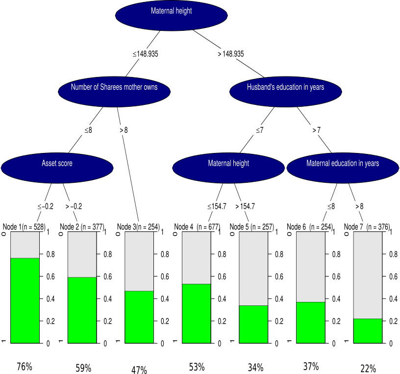

```{r setup, include=FALSE}
knitr::opts_chunk$set(echo = TRUE)

library(ggplot2)
library(plotly)
library(gridExtra)
library(shiny)
library(knitr)
```

# Assignment 1

The following image shows our adjusted version of the tree graph.

```{r assignment1, echo=FALSE}
 # need to be in the same directory as .Rmd
```

# Assignment 2

These data were obtained as part of the Study on the Efficacy of Nosocomial Infection Control (SENIC) to determine whether infection surveillance and control programs have reduced the rates of nosocomial (hospital-acquired) infection in US hospitals. This data set consists of a random sample of 113 hospitals

## 2.1

The data contain the following variables: a hospital id, the average length of stay of patients in days, the average age of the patients, the risk of infection in the hospital, the ratio of number of cultures performed to number of patients without signs or
symptoms of hospital-acquired infection, ratio of number of X-rays performed to number of patients without signs or symptoms of pneumonia, average number of beds in the hospital during study period, wether the hospital is affiliated with a medical school, geographic region, average number of patients during the study period, average number of full-time equivalent registered and licensed practical
nurses during study period and percent of 35 potential facilities and services that are provided by the
hospital.

```{r data}
SENIC <- read.table("SENIC.txt") # need to be in the same directory as .Rmd

colnames(SENIC) <- c("id", "length_stay", "age", "infection_risk", "culturing_ratio", "xray_ratio", "n_beds", "ms_affiliation", "region", "n_patients", "n_nurses", "services")
```

## 2.2

Writing a function that returns the indices of outliers.

```{r function}
assignment2 <- function(x){
  
  q1 <- quantile(x, probs = .25)
  q3 <- quantile(x, probs = .75)
  iqr <- q3 - q1
  
  outliers_l <- x < q1 - 1.5 * iqr
  outliers_u <- x > q3 + 1.5 * iqr
  outliers <- ifelse(outliers_l | outliers_u, TRUE, FALSE)
  
  which(outliers)
}
```

## 2.3

Plot the density of the infection risk and indicate outliers found by th function from 2.2.

```{r density1}
assignment3 <- ggplot() +
  geom_density(data = SENIC,
               aes(x = infection_risk)) +
  geom_point(data = SENIC[assignment2(SENIC$infection_risk), ],
             aes(x = infection_risk, y = 0), 
             shape = 5)
assignment3
```

From the graph can be inferred that most observations lie in the interval from 4 to 5 percent infection risk in the hospitals and the distribution is relatively symetrical. There are two outliers at the lower end at about 1 percent infection risk and three at the upper end at about 8 percent.

## 2.4

Here we show in principle the same graph as in 2.3 but for all metric variables of the dataset. There are two variables that are categorical and are threfore not considerd: medical school affiliation and region. The id is excluded as well.

```{r density2}
all_densities <- function(var, var_name, bw_adj){
  
  if(length(assignment2(var)) > 0){
    ggplot() +
      geom_density(aes(x = var), adjust = bw_adj) +
      geom_point(aes(x = var[assignment2(var)], 
                 y = 0), 
             shape = 5) +
      xlab(var_name)
  }
  
  else{
    ggplot() +
      geom_density(aes(x = var), adjust = bw_adj) +
      xlab(var_name)
  }
}

SENIC_metr <- SENIC[ , -c(1, 8:9)]
SENIC_metr_names <- colnames(SENIC_metr)
n_vars_metr <- 1:ncol(SENIC_metr)
bw_adj <- 1

for(c in n_vars_metr){
  var <- SENIC_metr[ , c]
  var_name <- SENIC_metr_names[c]
  
  assign(paste("density", c, sep = "_"), all_densities(var, var_name, bw_adj))
}

grid.arrange(density_1, density_2, density_3, density_4, density_5, density_6, density_7, density_8, density_9)
```

The included variables are all unimodal and either fairly symetrical or positively skewed. The variable with the most number of outliers is the number of nurses.

## 2.5

The following scatter plot shows the dependence of infection risk on the number of
nurses where the points are colored by the average number of beds.

```{r 2.5}
ggplot(SENIC) +
  aes(x = infection_risk,
      y=n_nurses,
      color = n_beds) +
  geom_point()
```

The plot shows the relation between infetction risk and number of nurses in the hospital while points are colored by number of beds.

The risk of using this color scheme is not being able to differentiate the relationship properly since color differentials are too small to be immediately recognised. 

However, while there is unsurprisingly a strong positive relationship between number of beds and number of nurses, the patterns concerning the infection risks is less clear. There might be positive relations between both number of beds and nurses to the infection risk.

## 2.6

Here we present an interactive version of 2.3.

```{r 2.6}
ggplotly(p = assignment3)
```

The added functionalities include being able to zoom into certain areas and to obtain precise values for the densities and outliers.


## 2.7

This section contains an interactive histogram of infection risk and outliers by using plotly library.Outliers are calculated by assignment2 function. 

```{r 2.7, warning=FALSE}


SENIC%>% 
  plot_ly( x = ~infection_risk,name = "infection rate") %>%
   add_histogram(title = "histogram of infection rate")%>%
     add_markers(data =  SENIC[assignment2(SENIC$infection_risk),],y=0,name = "outliers")%>%
        layout(title = "Infection rate density with outliers")

  
  
```

## 2.8

And finally, we present 2.4 as a ShinyApp where the respective variables can be individually selected. Also the bandwidth of the density estimation can be varied. But since the standard deviation of the kernel differs from variable to variable, we opted for an adjustment parameter instead of selecting a fixed bandwidth. This allows better comparisons between variables. The adjustment is just a multiplicator to the standard deviation of the kernel density.

```{r shinyapp}
interface <- fluidPage(
  sliderInput(inputId = "bw_adj",
              label = "Bandwidth Adjustment",
              min = 0.1, max = 2, value = 1),
  radioButtons(inputId = "var",
                     label = "Variables",
                     choiceValues = n_vars_metr,
                     choiceNames = SENIC_metr_names,
                     inline = TRUE),
  plotOutput("densities")
)

server <- function(input, output){
 output$densities <- renderPlot({
   all_densities(SENIC_metr[ , as.integer(input$var)], "", input$bw_adj)
   })
}

shinyApp(ui = interface, server = server, options = list(height = 600))
```

When adjusting the bandwidth, lower bandwidth mean that the density function more closely resembles the observed data while larger values produce smoother densities. We already stated above that a fixed bandwidth is not useful for comparisons but the better smoothing bandwidths for comparisons are based on the standard deviation of the kernel density estimates. The main purpose of a density plot is to get an idea about the underlying distribution that generates these data. Since too small bandwidths create a lot of local minima and maxima that distract from the overall pattern while too large values become more and more detached from the data, we would argue for an adjustment factor of 1.5.

# Contributions

Assignment 1 and the parts 5 to 7 show the solutions found by Varshith Konda. The remaining parts in Assignment 2, 1 to 4 and 8, were implemented by Malte Grönemann.
