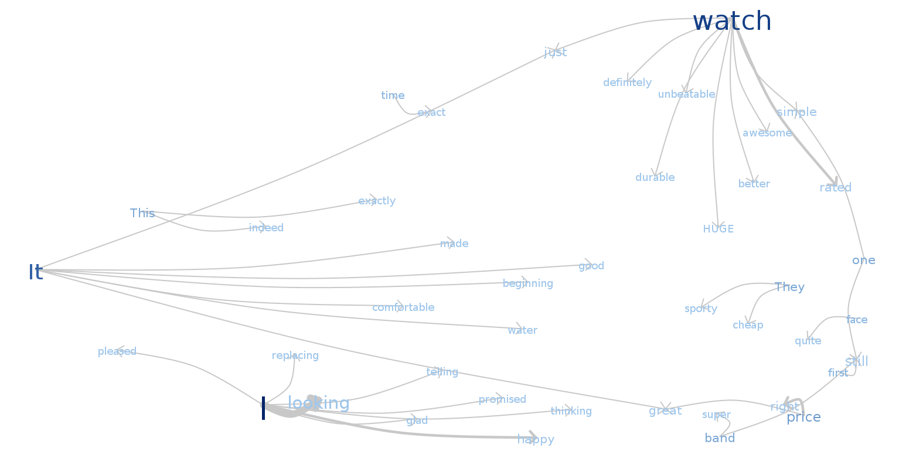
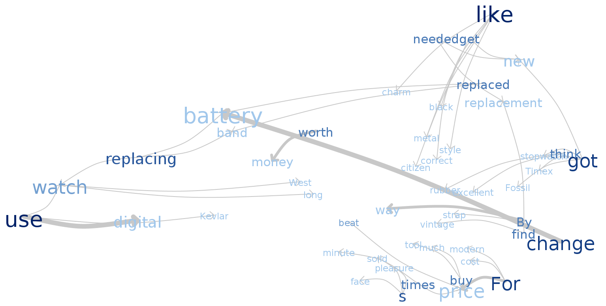
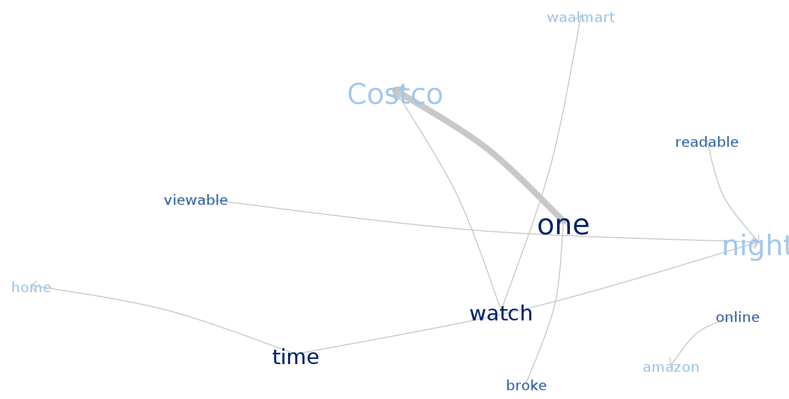
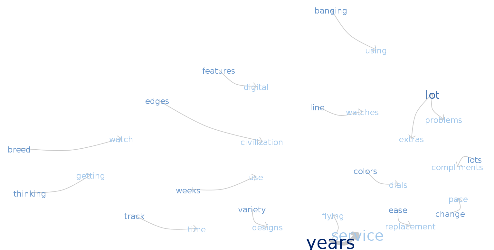
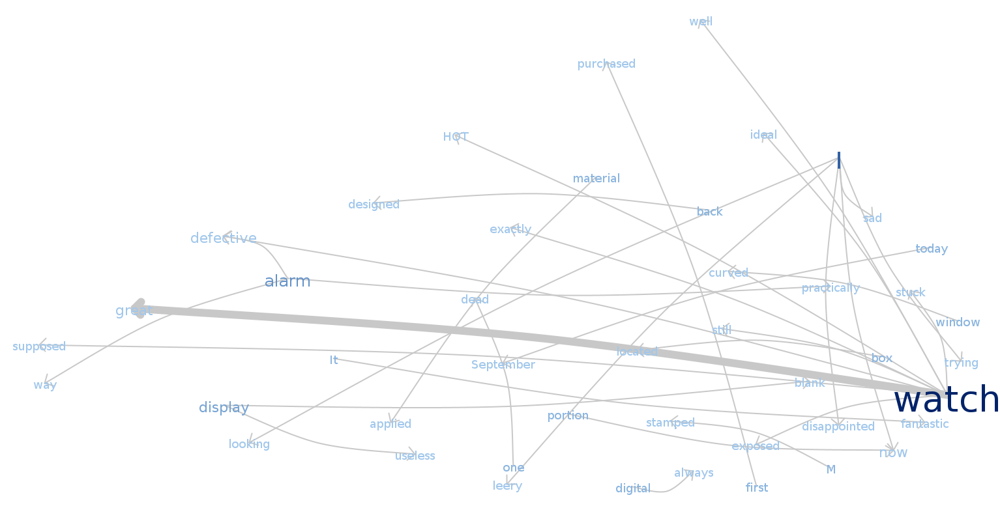
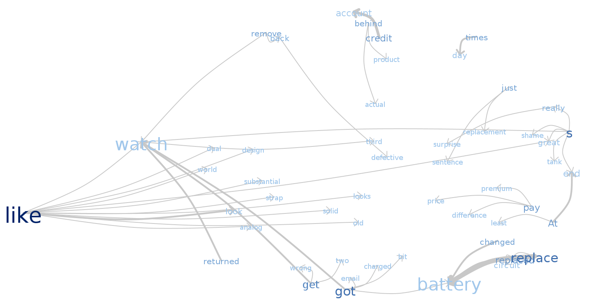
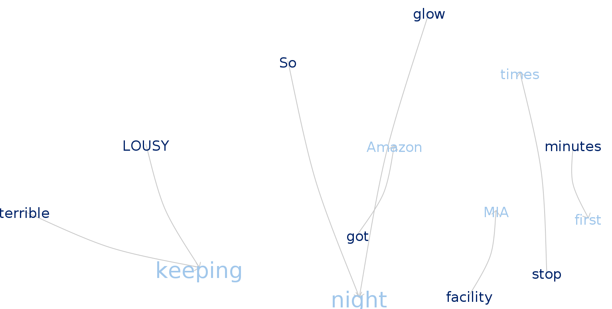

# Assignment 1

### Loading packages

```{r,packages, warning=FALSE,message=FALSE}
library(wordcloud2)
library(corpus)
library(tm)
library(knitr)
```


## Question 1  
Use R tools to create a word cloud corresponding to Five.txt and OneTwo.txt and adjust the colors in the way you like. Analyze the graphs.


### Wordcloud of the satisfied customer Reviews.

```{r,question 1 ,warning=FALSE}
Five <- read.csv("Five.txt",header = TRUE,sep = '\n',encoding = "UTF-8")
names(Five) = ("review")
Corpus_five <- Corpus(VectorSource(Five))


Corpus_five <- tm_map(Corpus_five, content_transformer(tolower))
Corpus_five<- tm_map(Corpus_five,removeWords,stopwords("English"))
Corpus_five <- tm_map(Corpus_five,removeNumbers)
Corpus_five <- tm_map(Corpus_five,removePunctuation)
Corpus_five <- tm_map(Corpus_five,stripWhitespace)


Five_tdm <- TermDocumentMatrix(Corpus_five)
Five_matrix <- as.matrix(Five_tdm) 
FS <- sort(rowSums(Five_matrix),decreasing = TRUE)
Five_dataframe <- data.frame(word = names(FS),freq = FS)

wordcloud2(data = Five_dataframe)


```


### Wordcloud of the Un satisfied customer Reviews.
```{r,q2,warning=FALSE }
OneTwo <- read.csv("OneTwo.txt",sep = '\n')
names(OneTwo)<- ("reviws")

Corpus_OneTwo <- Corpus(VectorSource(OneTwo))
Corpus_OneTwo <- tm_map(Corpus_OneTwo,content_transformer(tolower))
Corpus_OneTwo <- tm_map(Corpus_OneTwo,removeWords,stopwords("english"))
Corpus_OneTwo<- tm_map(Corpus_OneTwo,removeNumbers)
Corpus_OneTwo<- tm_map(Corpus_OneTwo,removePunctuation)
Corpus_OneTwo<- tm_map(Corpus_OneTwo,stripWhitespace)


OneTwo_tdm <- TermDocumentMatrix(Corpus_OneTwo)
OneTwo_matrix <- as.matrix(OneTwo_tdm)
OneTwo_fs <- sort(rowSums(OneTwo_matrix) ,decreasing = TRUE)
OneTwo_dataframe <- data.frame(word = names(OneTwo_fs),freq = OneTwo_fs)
wordcloud2(data = OneTwo_dataframe)

```


After removing stopwords, punctuation we created and data frame to get know the frequency of the words in both the reviews and created an wordcloud.

from the Word cloud it is observed that many customers frequecy of the word "watch " was high. 

In satisfied customer reviews the words "great" , "one" , "time" were also occured in high number.

In un satisfied customer reviews the words "amazon" , "casio","time" occured in high number as well.

Remaining words aooeared negkigible times.

## Question 2 

Create the phrase nets for Five.Txt and One.Txt with connector words

* am, is, are, was, were
* a, the
* at
* of
  where you choose ”Filter stopwords” option.

### 1. Phrases net for words (am, is, are, was, were) in Satisfied reviews.

```{r echo = FALSE}



```


### 2. Phrases net for words (a , the ) in Satisfied reviews. 


```{r echo = FALSE}



```


### 3. Phrases net for words (at) in Satisfied reviews.


```{r echo = FALSE}



```


### 4. Phrases net for words (of) in Satisfied reviews.


```{r echo = FALSE}



```


### 5. Phrases net for words (am, is, are, was, were) in Un-Satisfied reviews. 


```{r echo = FALSE}



```

### 6. Phrases net for words (at , the) in Un-Satisfied reviews. 
 

```{r echo = FALSE}



```

### 7. Phrases net for words (at) in Un-Satisfied reviews. 
 

```{r echo = FALSE}



```


### 8. Phrases net for words (of) in Un-Satisfied reviews. 
 

```{r echo = FALSE}

include_graphics("images/onetwo(of).png")

```


## Question 3


When you find an interesting connection between some words, use Word Trees to understand the context better.Analyze the graphs obtained and comment on the most interesting findings, like:


### Which properties of this watch are mentioned mostly often?


From analyzing  phrase nests obtained from the both satisfied and un satisfied reviews we have found out that customers were inclined towards liking certain aspects of the watch.

The properties of the that were mentioned by both the groups are :- 

* Battery
* Band
* Like 
* Digital
* Amazon


### What are satisfied customers talking about? 


When created an word tree using the key words from analyzing the key words ,Satisfied reviewers were mostly obliged with the reasonable price,loved the feel and stylish looks of the watch.

mostly they are describing about the likes and dislikes of the analog clock on top of digital clock,they found the analog watch is obstructing the view of digital clock.

But they were also positive about the rigidness of the watch casing but were dis satisfied with watch strap provided  by the manufacturer. 


### What are unsatisfied customers talking about? 


Their reviews mainly concerened about the heafty price for repairing damaged watch and warranty is not covering the cost of repair.

And they have also experienced that the analog segment movements were also damaged in less amount of time.


### What are good and bad properties of the watch mentioned by both groups?


Satisfied consumers were found out to be neutral in terms of  Amazon.com ,but the other consumers projected serious issue they faced by amazon warranty policies , customer services. Third party delivery system UPS delivery service was not able to deliver the product to the consumer,this created  an negative impression on amazon as well. 

Interestingly the reviewers from both groups were  positive about the look and feel of the watch,  aesthetic of the watch.

But the main and important issues where both the groups seemed dis satisfied is the battery property,Many watches have died very early from their purchase data , customers were forced to replace the battery within couple of months of use age.Quality and material used in the watch strap showed an negative impact.


### Can you understand watch characteristics (like type of display, features of the   
### watches by observing these graphs?


 As people have mentioned  the negative and positive properties of the watch we can interpret some characteristics of the watch.
 
* It was a dual watch of analog on top of digital.

* It has Black face and black band.

* It has screw down stems which makes the watch water-resistant


