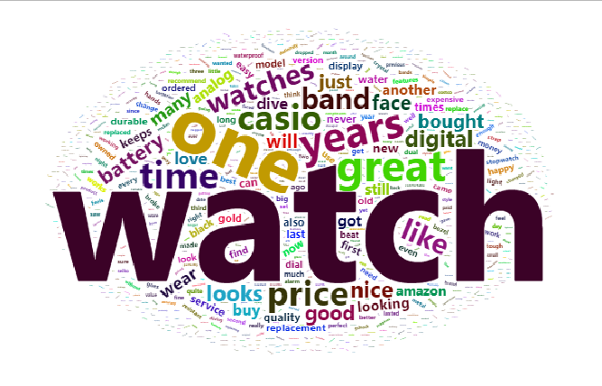

```{r setup, include=FALSE}
knitr::opts_chunk$set(echo = TRUE)
knitr::opts_chunk$set(message = FALSE)
knitr::opts_chunk$set(warning = FALSE)

library(plotly)
library(crosstalk)
library(htmltools)
library(GGally)
library(wordcloud2)
library(corpus)
library(tm)
library(knitr)
library(rmarkdown)
```

# Assignment 1

## 1.1

Use R tools to create a word cloud corresponding to Five.txt and OneTwo.txt and adjust the colors in the way you like. Analyze the graphs.

### Wordcloud of the satisfied Customer Reviews.

```{r 1_1}
Five <- read.csv("Five.txt",
                 header = TRUE,
                 sep = '\n',
                 encoding = "UTF-8")
names(Five) = ("review")

Corpus_five <- Corpus(VectorSource(Five))
Corpus_five <- tm_map(Corpus_five, 
                      content_transformer(tolower))
Corpus_five <- tm_map(Corpus_five,
                      removeWords,
                      stopwords("en"))
Corpus_five <- tm_map(Corpus_five,
                      removeNumbers)
Corpus_five <- tm_map(Corpus_five,
                      removePunctuation)
Corpus_five <- tm_map(Corpus_five,
                      stripWhitespace)

Five_tdm <- TermDocumentMatrix(Corpus_five)

Five_matrix <- as.matrix(Five_tdm) 

FS <- sort(rowSums(Five_matrix), decreasing = TRUE)

Five_dataframe <- data.frame(word = names(FS), freq = FS)

p1 <- wordcloud2(data = Five_dataframe)




```


### Wordcloud of the Unsatisfied customer Reviews.
```{r,q2,warning=FALSE }
OneTwo <- read.csv("OneTwo.txt",
                   header = TRUE,
                 sep = '\n',
                 encoding = "UTF-8")
names(OneTwo) <- ("reviews")

Corpus_OneTwo <- Corpus(VectorSource(OneTwo))
Corpus_OneTwo <- tm_map(Corpus_OneTwo, 
                      content_transformer(tolower))
Corpus_OneTwo <- tm_map(Corpus_OneTwo,
                      removeWords,
                      stopwords("en"))
Corpus_OneTwo <- tm_map(Corpus_OneTwo,
                      removeNumbers)
Corpus_OneTwo <- tm_map(Corpus_OneTwo,
                      removePunctuation)
Corpus_OneTwo <- tm_map(Corpus_OneTwo,
                      stripWhitespace)


OneTwo_tdm <- TermDocumentMatrix(Corpus_OneTwo)
OneTwo_matrix <- as.matrix(OneTwo_tdm)
OneTwo_fs <- sort(rowSums(OneTwo_matrix),
                  decreasing = TRUE)
OneTwo_dataframe <- data.frame(word = names(OneTwo_fs),
                               freq = OneTwo_fs)
p2 <- wordcloud2(data = OneTwo_dataframe)


```


After removing stopwords and punctuation we created and data frame to get know the frequency of the words in both the reviews and created an wordcloud.

from the Word cloud it is observed that many customers frequecy of the word "watch " was high. 

In satisfied customer reviews the words "great" , "one" , "time" were also occured in high number.

In un satisfied customer reviews the words "amazon" , "casio","time" occured in high number as well.

Remaining words appeared negligible times.

## 1.2


### 1. Phrases net for words (am, is, are, was, were) in Satisfied reviews.

```{r ,echo = FALSE}
include_graphics("images/five(am, is, are, was, were).png")
```

By specifying connecting words in phrase-nets software we obtained a phrase net  as displayed above.

The connector  words were mostly prefixed by "Watch" , "i" and "it" and suffixed by "replacing" , "durable" , "comfortable" , "looking" ,"good".

from the observed prefix and suffix words these senteces are framed :- 

* I was looking.
* It is comfortable.
* Watch is unbeatable.
* I am glad.

"It" and "watch" had few common words such as "great" , "just", "exact".

Most words and sentences were moderately positive.

### 2. Phrases net for words (a , the ) in Satisfied reviews. 

```{r echo = FALSE}
include_graphics("images/five(a,the).png")
```

The connector  words were mostly prefixed by "Change" , "use" and "like" ,"got" and suffixed by "replacing" , "way" , "replacing" , "digital" ,"battery".

From the observed prefix and suffix words these senteces are framed:

* Change the battery.
* Use a digital.
* Got a new one.
* Replaced the battery.

"Use" and "Like" , "change"  has  word "battery".

"Battery" found  out to be the word has high number of occurences in phrase nets.

Many customers are facing issue with the battery of the watch.


### 3. Phrases net for words (at) in Satisfied reviews.

```{r echo = FALSE}
include_graphics("images/five(at).png")
```

The connector  words were mostly prefixed by "one" , "watch" and "time" and suffixed by "costco" , "night" , "walmart".

From the observed prefix and suffix words these senteces are framed :

* One at costco.
* Watch at walmart.
* Readable at night.
* Time at home.
* online at amazon.

With the stop word "at", customers specified the retailer of their purchase.

Customers purchased their watches mostly from Costco and Amazon.

### 4. Phrases net for words (of) in Satisfied reviews.

```{r echo = FALSE}
include_graphics("images/five(of).png")
```


From the connector word "of" the prefix and suffix words are more scattered into nuclear sentences, but the word "Years" id observed to have high frequency.

From the observed connection these senteces are framed:

* Weeks of use.
* Track of time.
* Years of service.
* line of watches.


### 5. Phrases net for words (am, is, are, was, were) in Un-Satisfied reviews. 

```{r echo = FALSE}
include_graphics("images/onetwo(am, is, are, was, were).png")
```

The connector  words were mostly prefixed by "watch" , "I" and suffixed by "great" , "hot" , "disappointed" , "digital" ,"battery".

From the observed prefix and suffix words these senteces are framed:

* watch is defective.
* I am disappointed
* Watch was fantastic.

"Watch" found  out to be most the concentrated word in this phrase net.

### 6. Phrases net for words (at , the) in Un-Satisfied reviews. 

```{r echo = FALSE}
include_graphics("images/onetwo(a, the).png")
```

The connector  words were mostly prefixed by "Like , "got" ,"watch" and suffixed by "battery" , "returned".

From the observed prefix and suffix words these senteces are framed:

* Like the watch.
* Replace the battery.

"Battery" found  out to be most the concentrated word in this phrase net.

Similar to satisfied customers , negative reviewa also concludes both group of customers are facing issues with the battery of the watch.

### 7. Phrases net for words (at) in Un-Satisfied reviews. 

```{r echo = FALSE}
include_graphics("images/onetwo(at).png")
```

The connector  words were mostly prefixed by "lousy" , "glow" and "stop" and suffixed by "keeping" , "night".

From the observed prefix and suffix words these senteces are framed:

* Terrible at keeping.
* glow at amazon.
* stop at times.
* got at amazon.

In contrast to the positive reviews using the word "at" didn't provide us much information about  retailers.


### 8. Phrases net for words (of) in Un-Satisfied reviews. 

```{r echo = FALSE}
include_graphics("images/onetwo(of).png")
```

The connector  words were mostly prefixed by "piece" , "couple" and "model" and suffixed by "junk", "months" , "casio".

From the observed prefix and suffix words these senteces are framed:

* Couple of months.
* piece of junk.
* model of Casio.

Customers were not at all satisfied by the watch.

"Terms of amazon" states that customers were also disappointed by amazon's terms and conditions.


## 1.3

When you find an interesting connection between some words, use Word Trees to understand the context better.Analyze the graphs obtained and comment on the most interesting findings, like:

### Which properties of this watch are mentioned mostly often?

From analyzing  phrase nests obtained from the both satisfied and un satisfied reviews we have found out that customers were inclined towards liking certain aspects of the watch.

The properties of the that were mentioned by both the groups are :- 

* Battery
* Band
* Like 
* Digital
* Amazon

### What are satisfied customers talking about? 

When created an word tree using the key words from analyzing the key words ,Satisfied reviewers were mostly obliged with the reasonable price,loved the feel and stylish looks of the watch.

mostly they are describing about the likes and dislikes of the analog clock on top of digital clock,they found the analog watch is obstructing the view of digital clock.

But they were also positive about the rigidness of the watch casing but were dis satisfied with watch strap provided  by the manufacturer. 

### What are unsatisfied customers talking about? 

Their reviews mainly concerened about the heafty price for repairing damaged watch and warranty is not covering the cost of repair.

And they have also experienced that the analog segment movements were also damaged in less amount of time.

### What are good and bad properties of the watch mentioned by both groups?

Satisfied consumers were found out to be neutral in terms of  Amazon.com ,but the other consumers projected serious issue they faced by amazon warranty policies , customer services. Third party delivery system UPS delivery service was not able to deliver the product to the consumer,this created  an negative impression on amazon as well. 

Interestingly the reviewers from both groups were  positive about the look and feel of the watch,  aesthetic of the watch.

But the main and important issues where both the groups seemed dis satisfied is the battery property,Many watches have died very early from their purchase data , customers were forced to replace the battery within couple of months of use age.Quality and material used in the watch strap showed an negative impact.

### Can you understand watch characteristics (like type of display, features of the   
### watches by observing these graphs?

As people have mentioned  the negative and positive properties of the watch we can interpret some characteristics of the watch.
 
* It was a dual watch of analog on top of digital.

* It has Black face and black band.

* It has screw down stems which makes the watch water-resistant

# Assignment 2

In this assignment, you will continue analyzing data olive.csv that you started working with in lab 2.
These data contain information about contents of olive oils coming from different regions in Italy.
Each observation contains information about the region, the area from where the oil is from within the region and the amount different acids in the oil.

```{r data2}
olive <- read.csv("olive.csv")
olive <- olive[-1]
olive$Region[olive$Region == 1] <- "North"
olive$Region[olive$Region == 2] <- "South"
olive$Region[olive$Region == 3] <- "Sardinia"

olive_shared <- SharedData$new(olive)
```

## 2.1

Create an interactive scatter plot of the eicosenoic against linoleic. You have probably
found a group of observations having unusually low values of eicosenoic. Hover on these
observations to find out the exact values of eicosenoic for these observations.

```{r 2_1}
sca2_1 <- plot_ly(data = olive_shared,
        x = ~linoleic,
        y = ~eicosenoic,
        type = "scatter")
sca2_1 %>% layout(title = "Scatterplot of Linoleic and Eicosenoic")
```

There is a large cluster of oils that have only values for eicosenoic of 1, 2 and 3.

## 2.2

Link the scatterplot of (eicosenoic, linoleic) to a bar chart showing Region and a slider
that allows to filter the data by the values of stearic. Use persistent brushing to identify the regions that correspond unusually low values of eicosenoic. Use the slider and
describe what additional relationships in the data can be found by using it. Report which
interaction operators were used in this step.

```{r 2_2}
olive_shared1 <- SharedData$new(olive)
sca2_2 <- plot_ly(data = olive_shared1,
        x = ~linoleic,
        y = ~eicosenoic,
        type = "scatter")
sca2_2 <- sca2_2 %>% layout(title = "Scatterplot of Linoleic and Eicosenoic")

bar2_2 <- plot_ly(data = olive_shared1,
                  x = ~Region) %>%
  add_histogram() %>%
  layout(barmode = "overlay",
         title = "Region of Origin")

libs <- subplot(sca2_2, bar2_2) %>%
  highlight(on = "plotly_select",
            persistent = TRUE,
            dynamic = TRUE,
            opacityDim = I(1)) %>%
  hide_legend() %>%
  layout(title = "Linoleic and Eicosenoic by Stearic and Region",
         xaxis = list(title = "linoleic"),
         yaxis = list(title = "eicosenoic"))

slider_stearic <- filter_slider("stearic", "stearic", olive_shared1, ~stearic)

browsable(div(
  style = "display: flex; flex-wrap: wrap; justify-content: center",
  div(libs, style = "width: 100%"),
  div(slider_stearic, style = "width: 80%")))
```

The oils with very low levels of eicosenoic are exclusively the oils from the Southern region and Sardinia. All oils from the South have stearic levels between 197 and 273. Oils from the North and Sardinia have the whole range of linoleic and stearic. The used operators are filtering operators (in form of the stearic slider), and we ussed brushing which is a combination of the selection and connection operators.

## 2.3

Create linked scatter plots eicosenoic against linoleic and arachidic against linolenic.
Which outliers in (arachidic, linolenic) are also outliers in (eicosenoic, linoleic)? Are
outliers grouped in some way? Use brushing to demonstrate your findings.

```{r 2_3}
olive_shared2 <- SharedData$new(olive)
sca2_3 <- plot_ly(data = olive_shared2,
        x = ~linoleic,
        y = ~eicosenoic,
        type = "scatter")
sca2_3 <- sca2_3 %>% layout(title = "Scatterplot of Linoleic and Eicosenoic")

sca2_4 <- plot_ly(data = olive_shared2,
                  x = ~linolenic,
                  y = ~arachidic,
                  type = "scatter")

subplot(sca2_3, sca2_4, 
        titleX = TRUE, shareX = TRUE, titleY = TRUE) %>%
  highlight(on = "plotly_select",
            persistent = TRUE,
            dynamic = TRUE,
            opacityDim = I(1)) %>%
  hide_legend() %>%
  layout(title = "Eicosenoic and Arachidic by Linoleic",
         xaxis = list(title = "linoleic"),
         yaxis = list(title = "eicosenoic"),
         yaxis2 = list(title = "arachidic"))
```

The oils with the very low levels of eicosenoic can take all values of linoleic, linolenic and arachidic. They are therefore not outliers in the second scatter plot. However, the range of values in arachidic, more decreases, or more precisely, the lower bound rises, with the levels of eicosenoic.

## 2.4

Create a parallel coordinate plot for the available eight acids, a linked 3d-scatter plot in
which variables are selected by three additional drop boxes and a linked bar chart
showing Regions. Use persistent brushing to mark each region by a different color.
Observe the parallel coordinate plot and state which three variables (let’s call them
influential variables) seem to be mostly reasonable to pick up if one wants to
differentiate between the regions. Does the parallel coordinate plot demonstrate that
there are clusters among the observations that belong to the same Region? Select the
three influential variables in the drop boxes and observe in the 3d-plot whether each
Region corresponds to one cluster.

```{r 2_4}
# parallel coordinate plot
parco <- ggplotly(ggparcoord(olive, columns = c(3:10)))
parco <- plotly_data(parco) %>% group_by(.ID)
parco <- SharedData$new(parco, ~.ID, group = "olive")
parco <- plot_ly(parco, 
                 x = ~variable, 
                 y = ~value) %>%
  add_lines(line = list(width = 0.3)) %>%
  add_markers(marker = list(size = 0.3),
              text=~.ID,
              hoverinfo="text")

# linked 3D scatter
Button1 = list()
for (i in 3:10){
  Button1[[i-2]] = list(method = "restyle",
                         args = list("x", list(olive[[i]])),
                         label = paste("X:", colnames(olive)[i]))}
Button2 = list()
for (i in 4:10){
  Button2[[i-3]] = list(method = "restyle",
                         args = list("y", list(olive[[i]])),
                         label = paste("Y:", colnames(olive)[i]))}
Button3 = list()
for (i in 5:10){
  Button3[[i-4]] = list(method = "restyle",
                         args = list("z", list(olive[[i]])),
                         label = paste("Z:", colnames(olive)[i]))}

olive2 <- olive
olive2$.ID <- 1:nrow(olive2)
olive2 <- SharedData$new(olive2, ~.ID, group = "olive")

sca2_5 <- plot_ly(olive2, 
                  x = ~palmitic, 
                  y = ~palmitoleic,
                  z = ~stearic,
                  size = 0.5) %>%
  add_markers() %>%
  layout(title = "Select acids:",
    updatemenus = list(
      list(y = 0.9, buttons = Button1),
      list(y = 0.6, buttons = Button2),
      list(y = 0.3, buttons = Button3)))

# bar chart
bar2_4 <- plot_ly(data = olive2,
                  x = ~Region) %>%
  add_histogram() %>%
  layout(barmode = "overlay",
         title = "Region of Origin")

# combining

browsable(div(
  style = "display: flex; flex-wrap: wrap; justify-content: center",
  div(parco %>% 
        highlight(on = "plotly_select",
                  persistent = TRUE,
                  dynamic = TRUE,
                  opacityDim = I(1)) %>%
        hide_legend(), 
      style = "width: 100%"),
  div(sca2_5 %>% 
        highlight(on = "plotly_select",
                  persistent = TRUE,
                  dynamic = TRUE,
                  opacityDim = I(1)) %>%
        hide_legend(), 
      style = "width: 50%"),
  div(bar2_4 %>% 
        highlight(on = "plotly_select",
                  persistent = TRUE,
                  dynamic = TRUE,
                  opacityDim = I(1)) %>%
        hide_legend(), 
      style = "width: 50%")))
```

Our three selected variables are eicosenoic, oleic, and linolenic. We already know that we can perfectly separate zhe oils from the northern region from the other two regions with eicosenoic since Sardinia and the South have extremely low levels of this acid. A relatively good separator between Sardinia and the South is oleic with Sardinia usually having higher levels of it. The same holds true for linolenic where the southern oils always have higher values than the Sardinian ones.

## 2.5

Think about which interaction operators are available in step 4 and what interaction
operands they are be applied to. Which additional interaction operators can be added to
the visualization in step 4 to make it even more efficient/flexible? Based on the analysis
in the previous steps, try to suggest a strategy (or, maybe, several strategies) that would
use information about the level of acids to discover which regions different oils comes
from.

In the 3D scatter plot, the selection buttons are a selection operator that is applied to the data value space. The brushing (as a combination of selection and connection operators) is applied to the attribute space, namely the colour. The navigation operator (zooming, rotation of the 3D scatter) operates on the screen space. We could improve the plot by enabling changing the order of variables in the parallel coordinate plot. This would be a reconfiguring operator applied to the visualization structure space.

# Contributions

Varshith Konda worked on Assignment 1. Malte Grönemann answered Assignment 2.

# Appendix

The brushed images the interpretations in Assignment 2 are based on are appended here.

```{r appendix}
include_graphics("2_2.png")


```